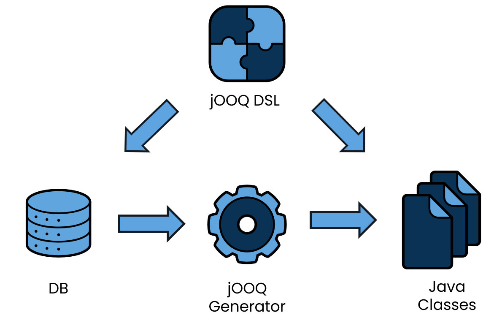
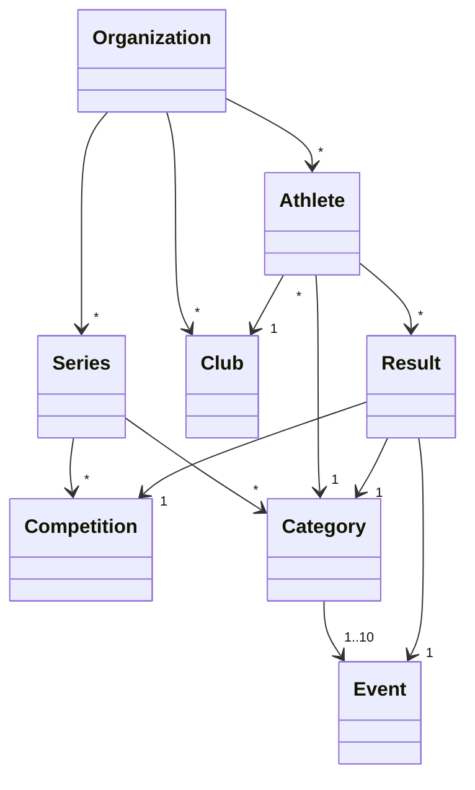

# Building data-centric applications with jOOQ

## How does jOOQ work?

## Showcase Project

### Track and Field Competitions

Filip Bossuyt from Kortrijk, Belgium, [CC BY 2.0](https://creativecommons.org/licenses/by/2.0)

### Data Model

### JTAF - Track and Field
- [JTAF Online](https://jtaf.ch)
- [Source Code on GitHub](https://github.com/72services/jtaf4)
